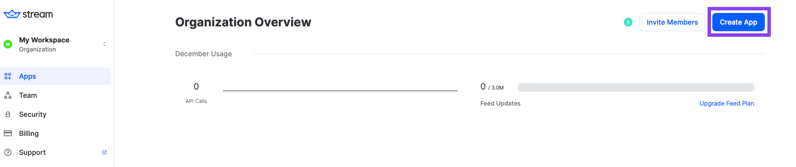

**Generative AI with Flutter** demonstrates [Google's Generative AI](https://ai.google.dev/tutorials/get_started_dart) on Flutter with [Stream Chat SDK for Flutter](https://getstream.io/chat/flutter/tutorial/?utm_source=github&utm_medium=referral&utm_content=&utm_campaign=devenossproject).

The purpose of this repository is to demonstrate below:

- Demonstrates [Gemini API](https://ai.google.dev/tutorials/get_started_dart) for Flutter.
- Integrating chat systems with [Stream Chat Flutter SDK](https://getstream.io/chat/flutter/tutorial/?utm_source=github&utm_medium=referral&utm_content=&utm_campaign=devenossproject) for real-time event handling.

## 🛥 Stream Chat & Video SDK

**Generative AI with Flutter** is built with __[Stream Chat SDK for Flutter](https://getstream.io/chat/sdk/flutter/?utm_source=github&utm_medium=referral&utm_content=&utm_campaign=devenossproject)__ to implement messaging systems. If you’re interested in building powerful real-time video/audio calling, audio room, and livestreaming, check out the __[Stream Video SDK for Flutter](https://getstream.io/video/sdk/flutter/tutorial/video-calling/?utm_source=github&utm_medium=referral&utm_content=&utm_campaign=devenossproject)__!

### Stream Chat

- [Stream Chat SDK for Flutter on GitHub](https://github.com/getStream/stream-chat-flutter)
- [Flutter Samples for Stream Chat SDK on GitHub](https://github.com/getStream/flutter-samples)

### Stream Video

- [Stream Video SDK for Flutter on GitHub](https://github.com/getstream/stream-video-flutter?utm_source=github&utm_medium=referral&utm_content=&utm_campaign=devenossproject)
- [Video Call Tutorial](https://getstream.io/video/sdk/flutter/tutorial/video-calling/?utm_source=github&utm_medium=referral&utm_content=&utm_campaign=devenossproject)
- [Audio Room Tutorial](https://getstream.io/video/sdk/flutter/tutorial/audio-room/?utm_source=github&utm_medium=referral&utm_content=&utm_campaign=devenossproject)
- [Livestream Tutorial](https://getstream.io/video/sdk/flutter/tutorial/livestreaming/?utm_source=github&utm_medium=referral&utm_content=&utm_campaign=devenossproject)

## 💻 How to build the project?

To build this project properly, you should follow the instructions below:

1. Go to the __[Stream login page](https://getstream.io/try-for-free/?utm_source=github&utm_medium=referral&utm_content=&utm_campaign=devenossproject)__.
2. If you have your GitHub account, click the **SIGN UP WITH GITHUB** button and you can sign up within a couple of seconds.


3. If you don't have a GitHub account, fill in the inputs and click the **START FREE TRIAL** button.
4. Go to the __[Dashboard](https://dashboard.getstream.io?utm_source=Github?utm_source=github&utm_medium=referral&utm_content=&utm_campaign=devenossproject)__ and click the **Create App** button like the below.



5. Fill in the blanks like the below and click the **Create App** button.


6. You will see the **Key** like the image below and then copy it.


7. Add the key you just retrieved to the `lib/data/config.dart` file:

```dart
class GenAIConfig {
  static String streamApiKey = "YOUR_STREAM_API_KEY";
  // ...
}
```

8. Go to your __[Dashboard](https://dashboard.getstream.io?utm_source=github&utm_medium=referral&utm_content=&utm_campaign=devenossproject)__ again and click your App.

9. In the **Overview** menu, you can find the **Authentication** category by scrolling to the middle of the page.

10. Switch on the **Disable Auth Checks** option and click the **Submit** button like the image below.


11. Click the **Explorer** tab on the left side menu.

12. Click **users** -> **Create New User** button sequentially and add fill in the user like the below:


- User Name: `gemini`
- User ID: `gemini`

13. Go to **[Google AI Studio](https://makersuite.google.com/app/apikey)**, login with your Google account and select the **Get API key** on the menu left like the image below:


14. Create your API key for using generative AI SDKs, and you'll get one like the image below:


15. Add the second key you just retrieved to the `lib/data/config.dart` file:

```gradle
class GenAIConfig {
  // ...
  static String geminiApiKey = "YOUR_GEMINI_API_KEY";
}
```

16. Build and run the project.